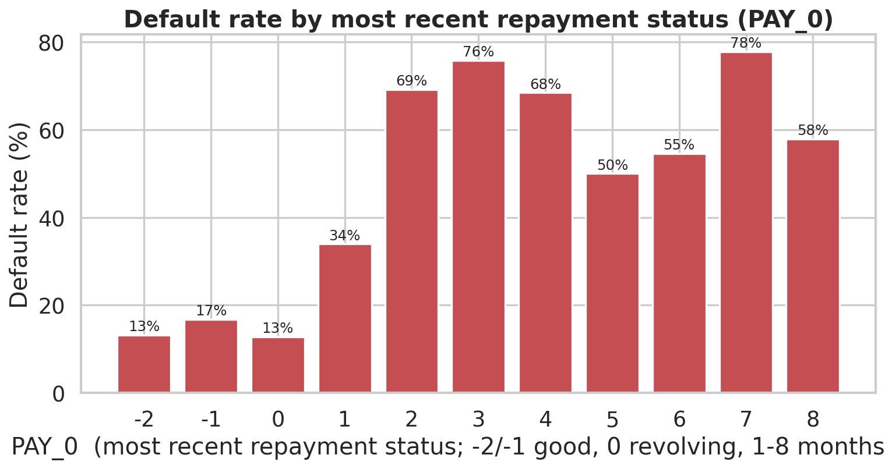
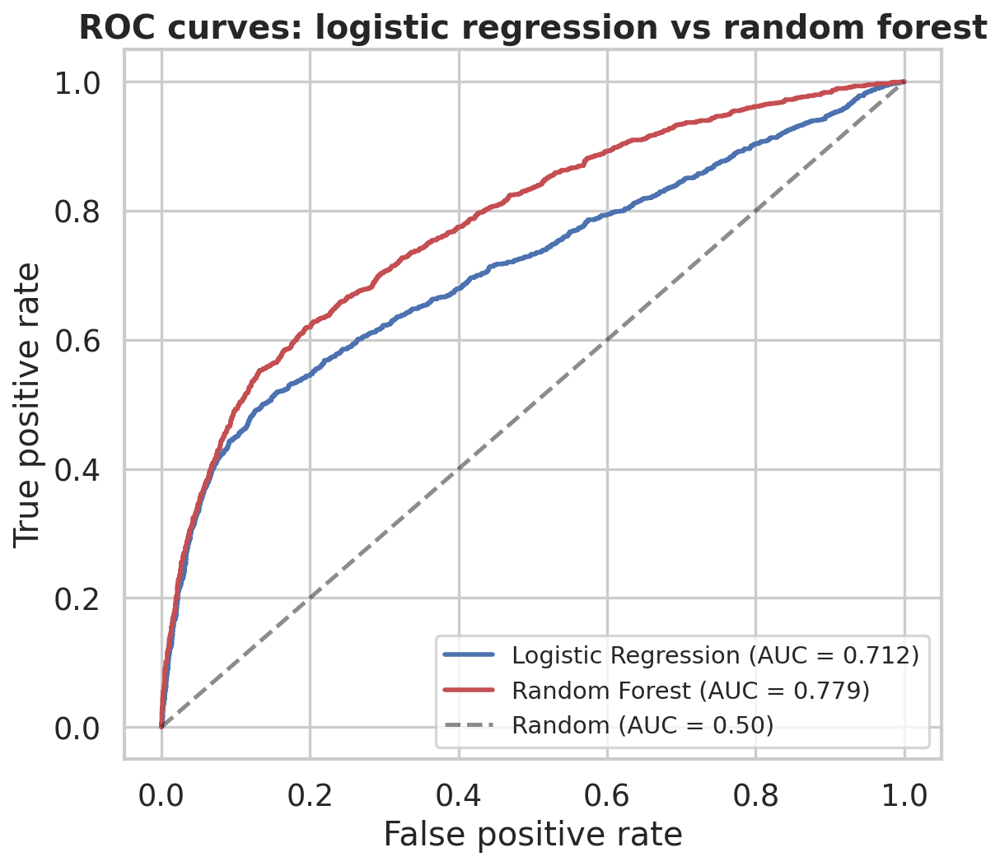
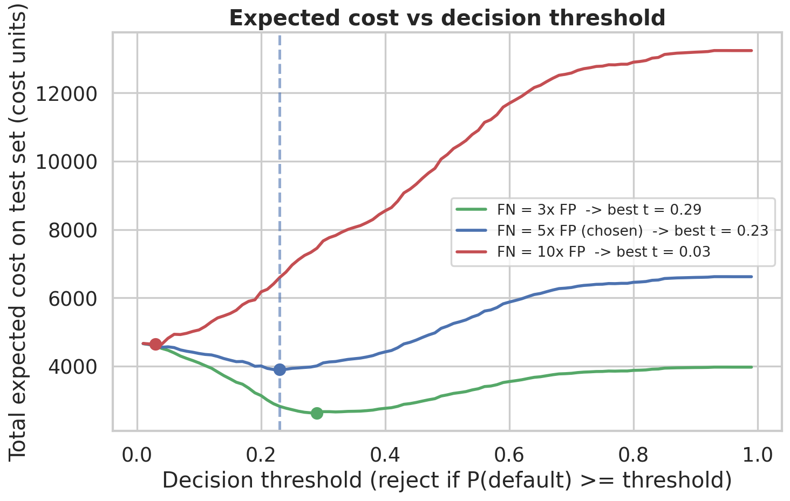

# Credit Card Default Risk: Predicting Who Defaults and Setting a Profit-Smart Approval Policy

Predict which credit card customers will default next month, then turn that model into a lending decision that loses the least money. The model score is only half the work. The other half is choosing a probability cutoff that reflects the real cost of a bad loan versus a missed good customer.

## Business question

Which customers will default next month, and where should a lender set its approval cutoff to minimize expected loss? Accuracy alone does not answer this, because approving a defaulter costs far more than turning away someone who would have paid.

## Dataset

UCI "Default of Credit Card Clients" (Taiwan, 2005). 30,000 clients, 23 features plus the target. The data covers six months of bills, payments, and repayment status, plus basic demographics.

- Source (UCI): https://archive.ics.uci.edu/dataset/350/default+of+credit+card+clients
- Kaggle mirror (`UCI_Credit_Card.csv`): https://www.kaggle.com/datasets/uciml/default-of-credit-card-clients-dataset

The raw CSV is not committed here. See [`data/README.md`](data/README.md) for the one-line download step.

## What I did

1. Loaded and inspected the data. 30,000 rows, no missing values, 22.1% default rate.
2. Cleaned two columns with undocumented codes. `EDUCATION` values 0, 5, 6 and `MARRIAGE` value 0 were folded into "other."
3. Ran EDA with six labeled charts (default rate overall, by credit limit, by repayment status, by age, a correlation heatmap, and a bill/payment distribution).
4. Built light, explainable features: credit utilization, average repayment status, and average bill and payment. One-hot encoded the categoricals. Stratified 80/20 split with a fixed seed.
5. Trained logistic regression as the primary model and a random forest as a comparison.
6. Evaluated both with a confusion matrix, precision, recall, F1, and ROC/AUC.
7. Assigned costs to the two mistakes and swept the decision threshold to find the one that minimizes expected loss.

## Key findings

**Recent repayment status drives default.** Once a client is even one month late, the default rate jumps well above the 22% baseline. `PAY_0` (the most recent month) is the single strongest predictor in both models.



**The random forest ranks risk better, but logistic regression is the decision model.** AUC was 0.78 for the random forest and 0.71 for logistic regression. The tree model picks up interactions the linear model cannot. I still use logistic regression to make the call, because a lender has to explain every rejection and a linear model gives that reason directly.



**A profit-smart cutoff beats the default 0.5.** Assuming a false negative (approving a defaulter) costs 5x a false positive (rejecting a good payer), the cost-minimizing threshold is **0.23**. Reject any applicant whose predicted default probability is at or above 0.23.



## Recommended policy and result

At a 0.23 cutoff on the held-out test set:

- Expected cost drops **24.5%** versus the naive 0.5 cutoff.
- Default rate inside the approved book falls to **13.5%**, down from the 22.1% portfolio baseline.
- The model catches **59%** of defaulters and rejects about 33% of applicants.

The threshold is a policy dial, not a fixed truth. At a 3x cost ratio it rises to about 0.29 (reject fewer). At 10x it drops near 0.03 (reject many more). The notebook shows all three.

## How to run

```bash
# 1. clone
git clone https://github.com/AlexBoukalis/credit-default-risk.git
cd credit-default-risk

# 2. download the dataset into data/ (see data/README.md)
#    you should end up with data/UCI_Credit_Card.csv

# 3. install
pip install -r requirements.txt

# 4. open the notebook and run all cells
jupyter notebook notebook/credit_default_risk.ipynb
```

A fixed random seed (42) makes the split and both models reproducible.

## Tools used

Python, pandas, numpy, scikit-learn, matplotlib, seaborn, Jupyter.

## Limitations

The data is one six-month window from a single market (Taiwan, 2005), so the patterns may not transfer. The 5-to-1 cost ratio is an assumption, not a measured number, and the recommended threshold moves with it. The model predicts only next-month default, and the features are intentionally simple. Next steps would be calibrating the predicted probabilities and validating the cost ratio against real recovery and margin figures.
